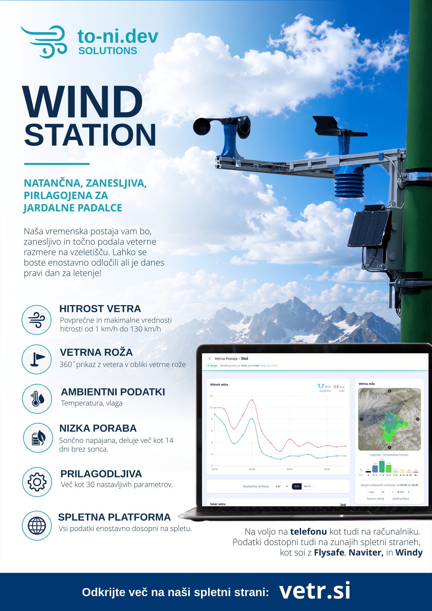

# ESP32-S2 Wind Station

This repository contains an Arduino project for an ESP32-S2 based wind and weather station. The device is intended to collect local wind and environment data, store short-term readings, and send the data to a remote server through a SIM800C cellular module.

## What It Does

- Measures wind speed with a Hall sensor.
- Measures wind direction with a 3D magnetic direction sensor.
- Reads inside and outside temperature/humidity sensors.
- Reads battery and solar panel voltage.
- Stores wind samples in memory before sending them.
- Sends data over cellular using HTTP or TCP.
- Uses configurable preferences stored in ESP32 non-volatile storage.
- Supports light sleep and deep sleep modes to reduce power usage.
- Tracks reset causes and error counters for debugging.

## Hardware

The project is built around an ESP32-S2 and uses several external modules/sensors:

- ESP32-S2 board
- SIM800C GPRS/cellular module
- Hall sensor for wind speed
- TLV493D-style 3D magnetic sensor for wind direction
- Temperature/humidity sensors
- Battery and solar voltage sensing circuit
- Status LEDs and control buttons
- Optional external watchdog circuit

Pin assignments are defined near the top of `esp32_s2_vetrna.ino`.

## Project Files

- `esp32_s2_vetrna.ino` - main Arduino sketch.
- `MyPrefs.h` - saved configuration/preferences and default settings.
- `sim800c_comunicator.h` - SIM800C AT command, HTTP, and TCP communication.
- `3d_mag_dir_sensor.h` - wind direction sensor handling.
- `speed_hal_sensor.h` - wind speed Hall sensor handling.
- `ErrorLogger.h` - persistent error counters.
- `ResetDiagnostics.h` - reset and wakeup diagnostics.
- `SimpleButton.h` - simple button handling.
- `FloatRunningAverage.h` - running average helper.
- `myTime.h` and `unix_compile_time.h` - time helpers.

## Configuration

Most runtime settings are stored in the `AppPrefs` structure in `MyPrefs.h`, including:

- server URLs and TCP server settings
- data send interval
- wind sample interval and log size
- sleep settings
- sensor enable/disable flags
- SIM800C timeout values
- voltage calibration constants

On boot, the sketch loads saved preferences from ESP32 NVS. If saved preferences are missing or invalid, it falls back to the defaults defined in the code.

## Building and Uploading

Open `esp32_s2_vetrna.ino` in the Arduino IDE or another Arduino-compatible build environment.

Required setup:

- ESP32 board support installed
- Correct ESP32-S2 board selected
- Required sensor and serial libraries available
- Hardware connected according to the pin definitions in the sketch

Then compile and upload the sketch to the ESP32-S2.

## Notes

This is a personal embedded project, so some values are specific to the original hardware and server setup. Before using it on another device, check the pin mappings, voltage calibration constants, sensor types, and server addresses.
